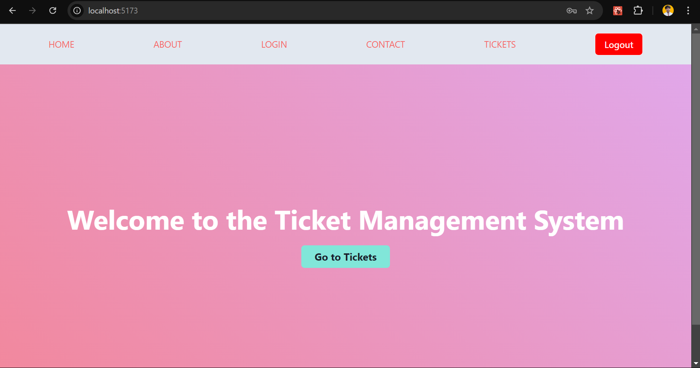
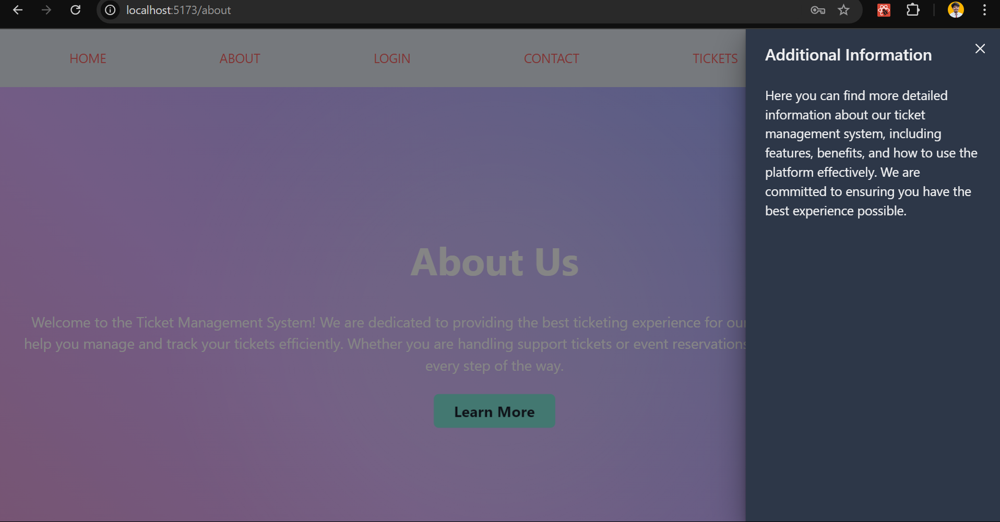
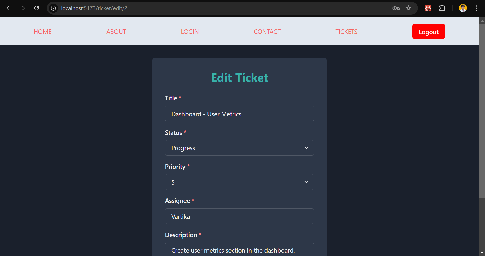
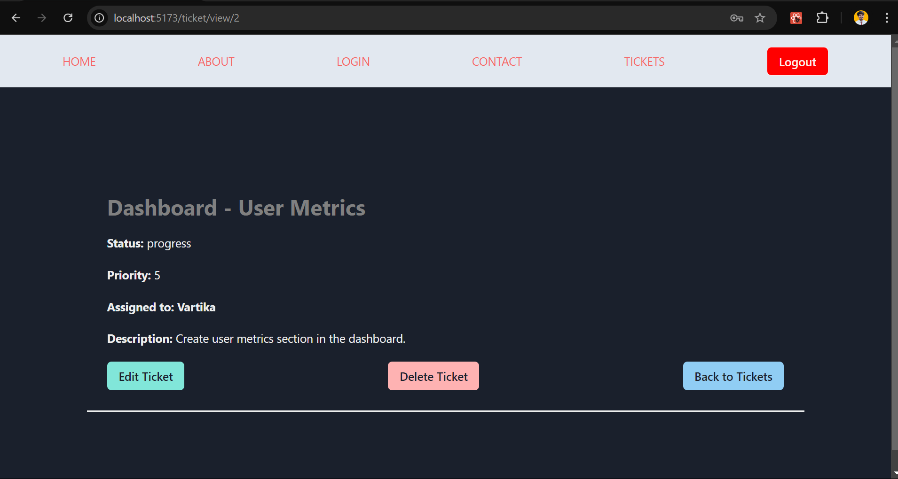

# React_Final_Project

># Using the following tools and technologies: React (useState, useContext, useEffect, useRef), Chakra UI, React Router, and Axios, your task is to build a web application with the following features:
```
EmailID : eve.holt@reqres.in
PAssword : cityslicka
```

using vite (https://vitejs.dev/guide/)

## Backend

## Frontend
    - Pages
        - Home
        - Login
        - Register
        - Tasks
        - About
        - Contact

    - Components
        - Navbar
        - AllRoutes

    - Tools that we will use to build the project
        - React and React-dom
        - Chakra ui for Styling 
        (https://v2.chakra-ui.com/getting-started)
        - React Router Dom for Routing 
        (https://www.npmjs.com/package/react-router-dom),
        (https://reactrouter.com/en/main/router-components/browser-router)
        - Axios For Fetching Data


---------------------------------------------------------------------------

>1. The web application should have multiple pages:

- Home
- About
- Contact
- Tickets
- Ticket View
- Ticket Create
- Ticket Edit
- Login

---------------------------------------------------------------------------

>2. The Navbar should be visible on all pages and include links to Home, About, Contact, Tickets, and Login. It should also have a LOGOUT button that logs out the user and redirects to the login page. The LOGOUT button should only be visible when the user is logged in.

---------------------------------------------------------------------------

>3. All pages except the Login page should be accessible only to logged-in users. If a user is not logged in, they should be redirected to the login page. This means that only the Login Page is a public route, while all other pages are private routes.

---------------------------------------------------------------------------

>4. Home Page: Create a visually appealing UI similar to this example.



---------------------------------------------------------------------------

>5. About Page: Create a visually appealing UI similar to this example.


---------------------------------------------------------------------------

>6. Contact Us Page: Use this page as a reference to build the Contact Us page.

---------------------------------------------------------------------------

>11. Login Page: This page will contain the following elements:


    - Input box for email
    - Input box for password

- **Create a login button.**
- **The login button will make a POST request to the API endpoint `https://reqres.in/api/login`.**
- **If the request is successful:**
  - Redirect to the Home page.
  - Save the returned token in the AuthContext.
- **If the request is unsuccessful:**
  - Display an error message.
- **Use AuthContext to maintain:**
  - `isLoggedIn` status.
  - The authentication token.


-------------------------------------------------------------------

># Tickets Page Design Notes


## Overview
The Tickets Page is designed to allow users to create, view, and manage tickets. This page will feature a button to create new tickets, a grid layout to display existing tickets, and sorting and filtering options to organize the tickets.

## Layout Done
- **Create Ticket Button**: Positioned at the top right corner, this button redirects users to the Ticket Create page.
- **Ticket Cards**: Tickets are displayed as cards in a grid layout:
  - **Large Screens (≥1200px)**: 3 cards per row
  - **Medium Screens (≥992px)**: 2 cards per row
  - **Small Screens (<992px)**: 1 card per row
- **Card Contents**: Each card includes:
  - Title
  - Status
  - Priority
  - View Button: Redirects to the Ticket View page

## Sorting and Filtering
- **Sort by Priority**:
  - "Low to High"
  - "High to Low"
- **Filter by Status**:
  - "Pending"
  - "Progress"
  - "Completed"

## Functionality
- **Create Ticket Button**: When clicked, redirects to the Ticket Create page.


- **View Button**: Each card's View button redirects to the Ticket View page for that specific ticket.


- **Sorting and Filtering**: 
  - Sort tickets by priority based on user selection (either "Low to High" or "High to Low").
  - Filter tickets by status based on user selection ("Pending", "Progress", "Completed").
  - The ticket display should update dynamically based on the selected sort and filter criteria.


